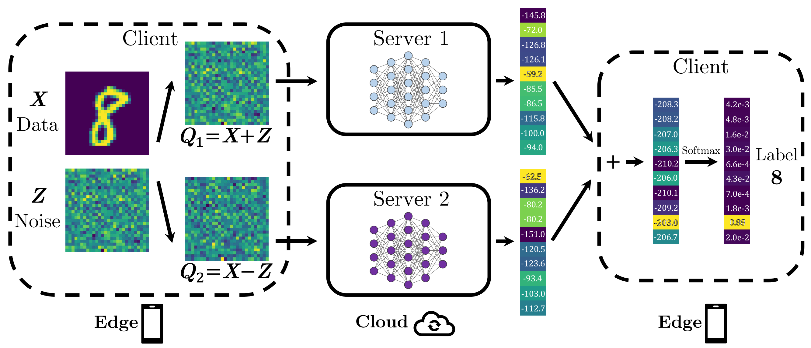

# Trained-MPC
This is the code for the paper [Trained-MPC: A Private Inference by Training-Based Multiparty Computation](https://openreview.net/forum?id=GdCO9uiD8Ss) (2023).



## Prerequisites
- Python 3.6+
- PyTorch 1.0+

## Reference 

```
@inproceedings{ehteram2023trainedmpc,
  title={Trained-MPC: A Private Inference by Training-Based Multiparty Computation},
  author={Ehteram, Hamidreza and Maddah-Ali, Mohammad Ali and Mirmohseni, Mahtab},
  booktitle={MLSys 2023 Workshop on Resource-Constrained Learning in Wireless Networks},
  year={2023}
}
```
